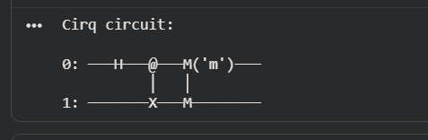
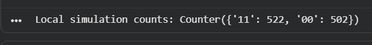
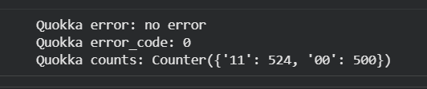
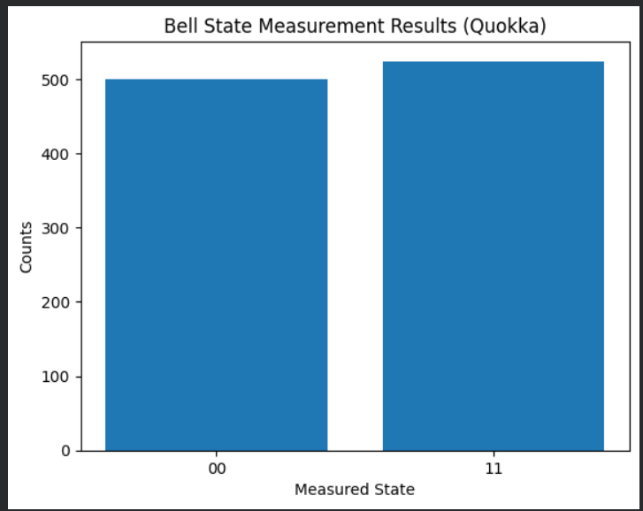

# Task 1 — Bell State Generation using Cirq on Quokka (LO2)

## Objective

The objective of this task is to generate a Bell entangled state using the Cirq quantum computing framework and execute the circuit on the Quokka quantum simulator.

The Bell state used in this experiment is:

|ψ⟩ = (|00⟩ + |11⟩) / √2

This state represents maximal entanglement between two qubits, meaning that measuring one qubit determines the state of the other.

---

# Circuit Design

The Bell state is generated using a two-qubit quantum circuit.

### Steps

1. Apply a **Hadamard gate (H)** to the first qubit to create superposition.
2. Apply a **CNOT gate** with the first qubit as control and the second qubit as target.
3. Measure both qubits.

---

# Circuit Implementation (Cirq)

```python
q0, q1 = cirq.LineQubit.range(2)

circuit = cirq.Circuit(
    cirq.H(q0),
    cirq.CNOT(q0, q1),
    cirq.measure(q0, q1, key="m")
)
```

---

# Circuit Visualization



**Figure 1:** Quantum circuit used to generate the Bell state.

The Hadamard gate creates superposition while the CNOT gate entangles the two qubits.

---

# Generated OpenQASM Code

The circuit was exported to OpenQASM format in order to execute it on the Quokka simulator.

```qasm
OPENQASM 2.0;
include "qelib1.inc";

qreg q[2];
creg m_m[2];

h q[0];
cx q[0],q[1];

measure q[0] -> m_m[0];
measure q[1] -> m_m[1];
```

---

# Local Simulation Results (Cirq)

The circuit was first executed using the Cirq simulator with 1024 measurement shots.

Example output:

```
Local simulation counts:
Counter({'11': 522, '00': 502})
```



**Figure 2:** Measurement results from the Cirq local simulator.

The output shows that only the states **00** and **11** appear with approximately equal probability, which matches the theoretical Bell state behaviour.

---

# Execution on Quokka Quantum Simulator

The circuit was then executed on the Quokka quantum simulator using its QASM execution API.

Server used:

```
http://quokka2.quokkacomputing.com/qsim/qasm
```

Example output:

```
Quokka counts:
Counter({'11': 524, '00': 500})
```



**Figure 3:** Measurement results obtained from the Quokka simulator.

---

# Measurement Distribution

To better visualise the probability distribution of the Bell state measurement outcomes, a histogram of the measured states was generated using the Quokka simulation results.



**Figure 4:** Histogram showing the measurement distribution of the Bell state.  
The results demonstrate approximately equal probability for the states **|00⟩** and **|11⟩**, which confirms the expected behaviour of the Bell entangled state.

# Result Analysis

Both the local simulator and the Quokka simulator produced measurement outcomes dominated by the states:

|00⟩  
|11⟩

with approximately equal probability.

This confirms that the circuit successfully generated the Bell state:

|ψ⟩ = (|00⟩ + |11⟩) / √2

The absence of states **01** and **10** demonstrates that the qubits are entangled.

---

# Conclusion

This experiment successfully demonstrated the creation of an entangled Bell state using Cirq. The circuit was validated using both a local simulator and the Quokka quantum simulator. The measurement results confirmed the theoretical expectation of equal probability for the states **00** and **11**, demonstrating correct implementation of quantum superposition and entanglement.