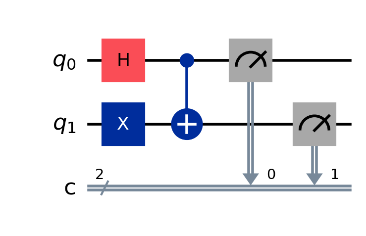
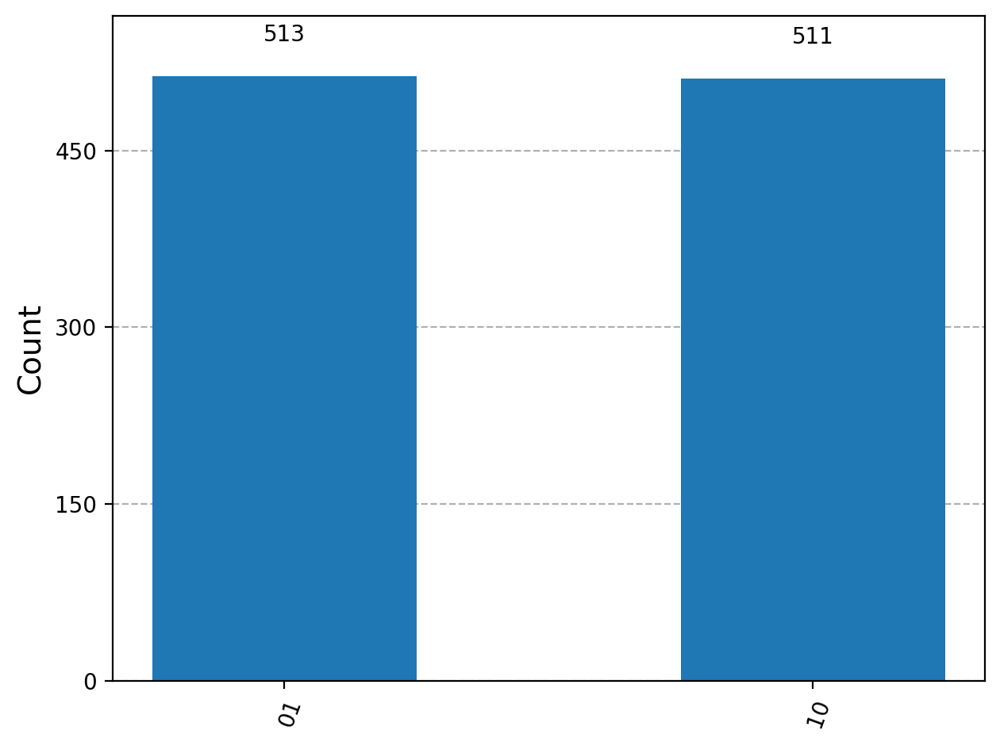
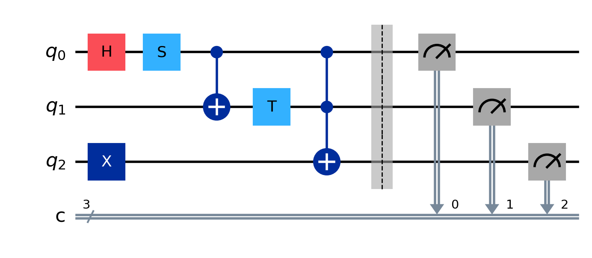
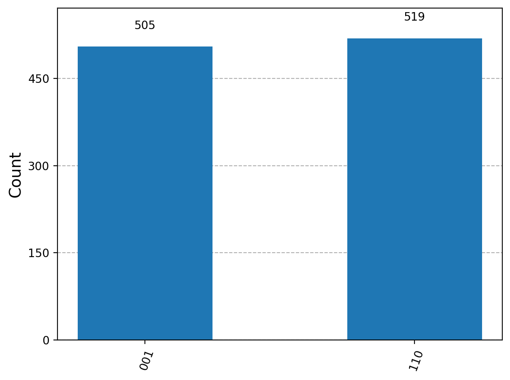

# Task 2 — Qiskit Circuits Executed on Quokka (LO1, LO2)

## Objective

The objective of this task is to implement quantum circuits using the **Qiskit framework**, convert them into **OpenQASM format**, and execute them on the **Quokka quantum simulation platform**.

Two circuits are implemented:

1. The **required circuit provided in the assignment**
2. A **custom quantum circuit designed using multiple quantum gates**

All experiments were executed with **1024 measurement shots** using the Quokka API endpoint:

```
http://quokka2.quokkacomputing.com/qsim/qasm
```

---

# Part A — Implementation of the Required Circuit

## Circuit Description

The circuit provided in the assignment consists of the following quantum operations:

1. **Hadamard gate (H)** applied to qubit `q0`
2. **Pauli-X gate (X)** applied to qubit `q1`
3. **Controlled operation (C)** between the two qubits  
   In Qiskit this was implemented as a **Controlled-NOT gate (CX)** where:

   - `q0` acts as the control qubit  
   - `q1` acts as the target qubit

4. Measurement of both qubits.

This circuit demonstrates the interaction between **single-qubit gates and two-qubit controlled operations**.

---

## Qiskit Implementation

```python
qc_req = QuantumCircuit(2,2)

qc_req.h(0)
qc_req.x(1)
qc_req.cx(0,1)

qc_req.measure([0,1],[0,1])
```

---

## Circuit Visualization



**Figure 1:** Qiskit visualization of the required circuit.

---

## OpenQASM Representation

The circuit was exported into **OpenQASM 2.0**, which is a standard assembly language used for representing quantum circuits.

```qasm
OPENQASM 2.0;
include "qelib1.inc";

qreg q[2];
creg c[2];

h q[0];
x q[1];
cx q[0],q[1];

measure q[0] -> c[0];
measure q[1] -> c[1];
```

The generated QASM script was submitted to the Quokka simulator for execution.

---

## Measurement Results

The circuit was executed on the Quokka simulator using **1024 measurement shots**.

Output obtained:

```
Counter({'10': 523, '01': 501})
```

---

## Measurement Distribution



**Figure 2:** Measurement distribution obtained from the Quokka simulator.

---

## Result Interpretation

The results show that the circuit produces two dominant output states: **01** and **10**.

This behaviour arises from the interaction of the quantum gates in the circuit. The **Hadamard gate** places the first qubit into a superposition state, while the **Pauli-X gate** flips the state of the second qubit. The **Controlled-NOT gate** then introduces correlation between the two qubits.

Because quantum measurements are probabilistic, the counts are approximately balanced but not exactly equal. This variation is expected when running a finite number of measurement shots.

---

# Part B — Custom Quantum Circuit

## Circuit Design

A custom quantum circuit was designed using **three qubits** and several different quantum gates to demonstrate a more complex quantum program.

The circuit includes the following operations:

- **Hadamard gate (H)** to create superposition
- **Phase gates (S and T)** to introduce phase shifts
- **Controlled-NOT gate (CX)** to create entanglement
- **Toffoli gate (CCX)** for three-qubit conditional logic
- Measurement of all qubits

This circuit demonstrates how different gate combinations influence the evolution of quantum states.

---

## Qiskit Implementation

```python
qc_custom = QuantumCircuit(3,3)

qc_custom.h(0)
qc_custom.s(0)
qc_custom.cx(0,1)
qc_custom.t(1)
qc_custom.x(2)
qc_custom.ccx(0,1,2)

qc_custom.measure([0,1,2],[0,1,2])
```

---

## Circuit Visualization



**Figure 3:** Custom three-qubit quantum circuit implemented using Qiskit.

---

## OpenQASM Script

```qasm
OPENQASM 2.0;
include "qelib1.inc";

qreg q[3];
creg c[3];

h q[0];
s q[0];
cx q[0],q[1];
t q[1];
x q[2];
ccx q[0],q[1],q[2];

measure q[0] -> c[0];
measure q[1] -> c[1];
measure q[2] -> c[2];
```

---

## Measurement Results

The custom circuit was executed on the Quokka simulator using **1024 measurement shots**.

Output obtained:

```
Counter({'001': 535, '110': 489})
```

---

## Measurement Distribution



**Figure 4:** Histogram showing measurement outcomes for the custom circuit.

---

## Result Interpretation

The measurement results indicate that the probability distribution is concentrated in two dominant states. This behaviour results from the interaction between superposition, phase operations, and conditional multi-qubit gates.

The **Toffoli gate (CCX)** introduces a three-qubit controlled operation, demonstrating how more complex logic can be implemented within quantum circuits. The presence of phase gates (**S** and **T**) further modifies the quantum state before measurement.

These results illustrate how combinations of quantum gates influence state evolution and measurement probabilities.

---

# Conclusion

This task demonstrated the design and execution of quantum circuits using the **Qiskit programming framework** and the **Quokka quantum simulation platform**.

The required circuit verified the correct implementation of the provided gate sequence, while the custom circuit demonstrated the ability to construct a more complex quantum circuit using multiple qubits and quantum gates.

The measurement results obtained from Quokka confirm the expected probabilistic behaviour of quantum circuits and illustrate how quantum gate operations influence final measurement outcomes.

Overall, this experiment demonstrates the workflow of **quantum circuit design, OpenQASM generation, remote simulation, and analysis of quantum measurement results**.