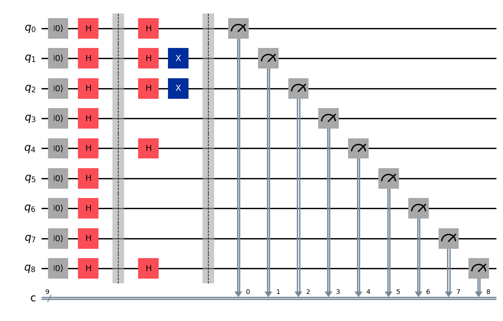
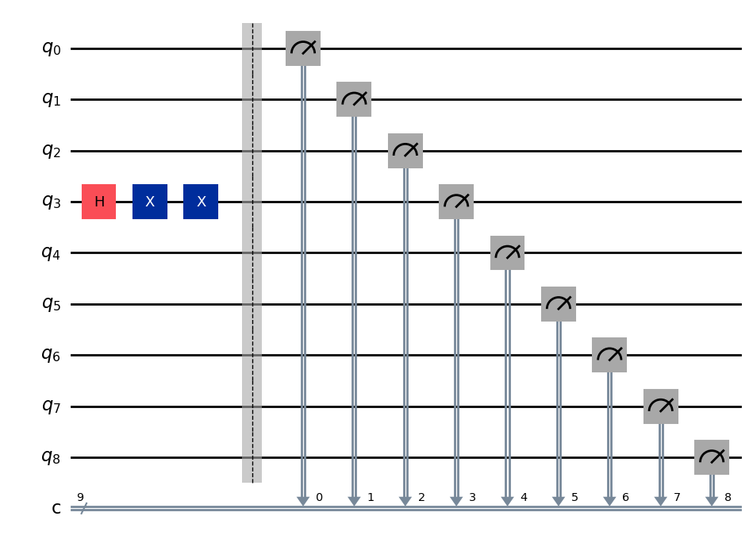
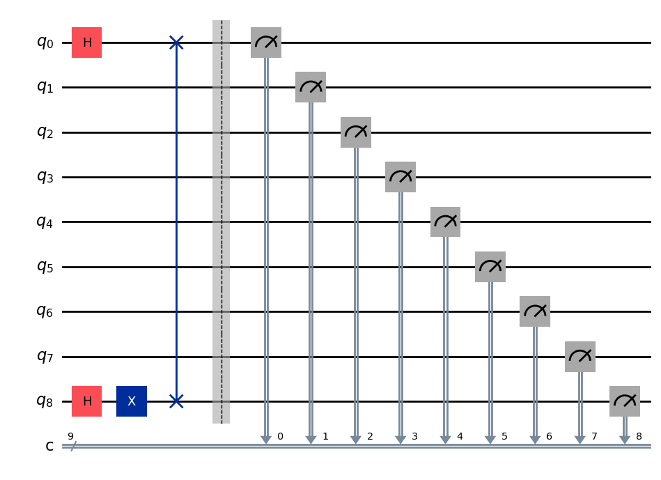

# Task 3 — Investigate a Quantum Codes
---

# 1. Objective

The objective of this task is to investigate a partially developed quantum computing program that generates a **quantum circuit through gameplay**.

The provided notebook implements a **Quantum Tic-Tac-Toe game** using the Qiskit quantum computing framework.

The goals of this task are to:

- Understand how the provided quantum program works
- Analyse how gameplay generates quantum circuits
- Identify the quantum gates used in the circuit
- Run the program multiple times and capture generated circuits
- Explain the behaviour of the quantum system

---

# 2. Overview of the Program

The program implements a **quantum version of the tic-tac-toe game**.

In this implementation:

- Each tile on the board corresponds to a **qubit**
- The board therefore uses **9 qubits**
- Each qubit is measured into **9 classical bits**

| Tile | Qubit |
|-----|------|
| 0 | q0 |
| 1 | q1 |
| 2 | q2 |
| 3 | q3 |
| 4 | q4 |
| 5 | q5 |
| 6 | q6 |
| 7 | q7 |
| 8 | q8 |

The circuit is defined as:

```python
QuantumCircuit(9,9)
```

This means:

- 9 quantum bits
- 9 classical bits

The program contains two main classes.

### Board Class

The **Board class** manages:

- the quantum circuit
- board state
- measurement process
- win calculation

### Game Class

The **Game class** controls:

- the graphical interface
- player input
- interaction with the Board class

---

# 3. Initial Quantum State

At the beginning of each round the program prepares the circuit.

The following operations are applied:

```python
self.qc.reset(idx)
self.qc.h(idx)
```

### Reset Gate

The reset gate initializes the qubit into the state:

|0⟩

### Hadamard Gate

After reset, the **Hadamard gate (H)** is applied.

The Hadamard transforms the state as:

|0⟩ → (|0⟩ + |1⟩) / √2

This creates **quantum superposition**.

Therefore every tile begins in a state where it is **both possible outcomes at the same time**.

The final board result is only determined after measurement.

---

# 4. Quantum Gates Used

The gameplay options correspond directly to quantum gates.

## 4.1 Hadamard Gate (H)

Purpose:

- Creates superposition
- Allows tiles to exist in multiple possible states

Mathematical transformation:

|0⟩ → (|0⟩ + |1⟩) / √2

This gate is applied to **every qubit at the start of the game**.

---

## 4.2 Pauli-X Gate (X)

The Pauli-X gate flips a qubit.

|0⟩ ↔ |1⟩

In the program this gate is used for:

- **NOT move**
- part of the **X move**

Applying the X gate changes the ownership of the tile.

---

## 4.3 SWAP Gate

The SWAP gate exchanges the states of two qubits.

Mathematical form:

SWAP(|a⟩|b⟩) = |b⟩|a⟩

This allows two board positions to exchange their quantum states.

This is a **two-qubit operation**.

---

## 4.4 Measurement

Measurement collapses the quantum state.

When the player presses **Measure**, the following code runs:

```python
for i in range(9):
    self.qc.measure(i, i)
```

The simulator then executes the circuit.

Example measurement result:

```
010101011
```

The program converts bits into board symbols.

| Bit | Result |
|----|----|
| 0 | X |
| 1 | O |

Thus measurement determines the final board configuration.

---

# 5. Gameplay Experiments

The game was executed multiple times to observe the behaviour of the quantum circuit.

Three rounds were captured.

---

# Round A — Basic Gameplay

This round demonstrates:

- Hadamard initialization
- gameplay operations
- measurement



**Figure 1:** Circuit produced during Round A.

Observation:

All qubits begin with **Hadamard gates**, placing them in superposition.

Additional gameplay operations modify specific qubits before measurement.

---

# Round B — NOT Gate Demonstration

This round demonstrates the behaviour of the **Pauli-X gate**.



**Figure 2:** Circuit showing repeated X gates.

Observation:

Two consecutive X gates appear on the same qubit.

This illustrates the reversible property of quantum gates:

X · X = Identity

Applying X twice cancels the effect.

---

# Round C — SWAP Gate Demonstration

This round demonstrates a **two-qubit interaction**.



**Figure 3:** Circuit containing a SWAP gate.

Observation:

The SWAP gate exchanges the quantum states of two tiles.

This demonstrates how quantum operations can move information between qubits.

---

# 6. Win Detection Logic

After measurement, the program checks the possible winning combinations.

There are **8 winning conditions** in tic-tac-toe.

Rows

(0,1,2)  
(3,4,5)  
(6,7,8)

Columns

(0,3,6)  
(1,4,7)  
(2,5,8)

Diagonals

(0,4,8)  
(2,4,6)

The program counts the number of wins for each player.

---

# 7. Observations

The program demonstrates several important quantum computing concepts.

### Superposition

Hadamard gates place qubits into superposition.

### Reversible Gates

The Pauli-X gate demonstrates reversible quantum operations.

### Multi-Qubit Interaction

The SWAP gate exchanges states between qubits.

### Measurement Collapse

The final board state only appears after measurement collapses the quantum system.

---

# 8. Conclusion

This task investigated a quantum tic-tac-toe program that dynamically generates quantum circuits through gameplay actions.

The analysis showed that:

- Each board tile corresponds to a qubit
- Gameplay operations map directly to quantum gates
- The circuit evolves as the player makes moves
- Measurement collapses the quantum state into classical results

This experiment demonstrates fundamental quantum computing concepts including **superposition, reversible gates, multi-qubit operations, and measurement**.

---