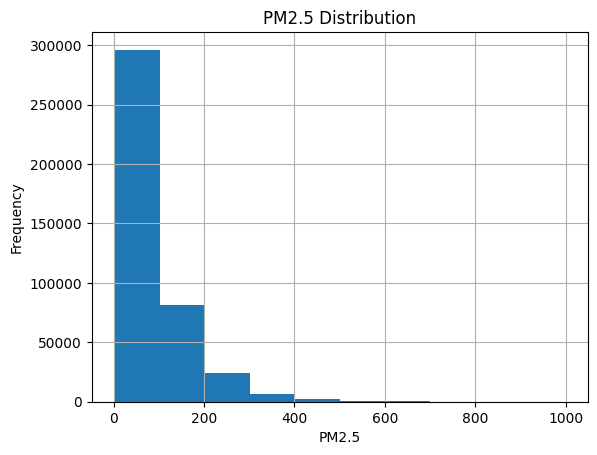
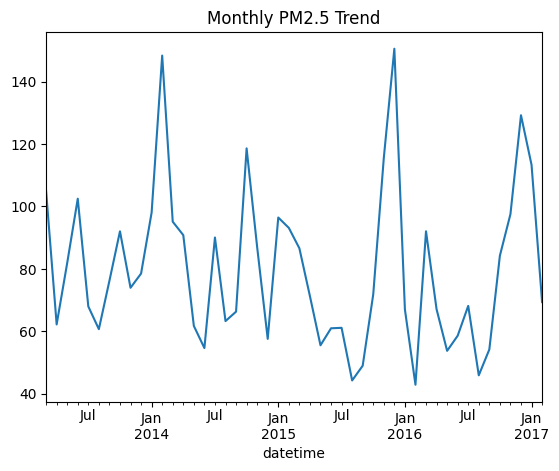
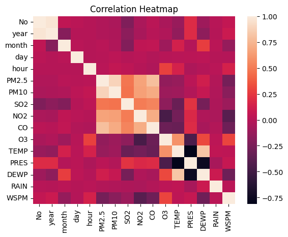
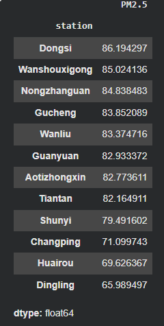
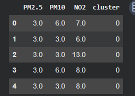

# Beijing Multi-Site Air Quality Analysis

## 1. Introduction

Air pollution is a critical environmental and public health issue, especially in large urban areas. This project analyzes the Beijing Multi-Site Air Quality dataset, which contains hourly measurements of major air pollutants and meteorological variables from multiple monitoring stations between 2013 and 2017.

The objective of this analysis is to explore pollution patterns, understand relationships between variables, and apply basic machine learning techniques to predict air quality levels.

---

## 2. Dataset Description

The dataset contains **420,768 observations and 18 features**, including:

- Air pollutants: PM2.5, PM10, SO2, NO2, CO, O3  
- Meteorological variables: Temperature (TEMP), Pressure (PRES), Dew Point (DEWP), Rain (RAIN)  
- Wind information: Wind direction (wd), Wind speed (WSPM)  
- Time variables: Year, Month, Day, Hour  
- Location: Station  

Most variables contain a small percentage of missing values (generally below 5%), making the dataset suitable for analysis without major data loss.

---

## 3. Data Exploration

### 3.1 Initial Observations

The dataset is large and multivariate, combining environmental and temporal variables. PM2.5 is used as the primary indicator of air pollution.

---

### 3.2 Missing Values

Some missing values are present, particularly in:

- CO (~4.9%)  
- O3 (~3.1%)  
- NO2 (~2.8%)  

Other variables have minimal missing data.

**Insight:**  
The missing values are relatively small and consistent with real-world environmental datasets.

---

## 4. Statistical Analysis

### 4.1 Distribution of PM2.5

The distribution of PM2.5 is right-skewed, with most values below 150. However, extreme values reach up to 999.

**Insight:**  
While air pollution is often moderate, there are significant extreme pollution events, which are important for environmental monitoring.

---

### 4.2 Seasonal Trends

PM2.5 levels vary significantly across months:

- Highest: Winter months (December–January)  
- Lowest: Summer months (July–August)  

**Insight:**  
Air pollution shows strong seasonal variation, likely influenced by heating activities and weather conditions.

---

### 4.3 Correlation Analysis

Key relationships:

- Strong positive:
  - PM2.5 & PM10 (0.88)  
  - PM2.5 & CO (0.79)  
  - PM2.5 & NO2 (0.67)  

- Negative:
  - PM2.5 & Wind Speed  
  - NO2 & O3  

**Insight:**  
Pollutants are highly interrelated, and environmental factors such as wind play an important role in reducing pollution levels.

---

### 4.4 Station Analysis

Average PM2.5 levels vary across stations:

- Most polluted: Dongsi, Wanshouxigong  
- Least polluted: Dingling, Huairou  

**Insight:**  
Air pollution differs by location, likely due to urban density and industrial activity.

---

### 4.5 Outlier Detection

A total of **19,142 outliers** were identified.

**Insight:**  
These represent extreme pollution events and are important for identifying hazardous conditions.

---

## 5. Machine Learning Analysis

### 5.1 Linear Regression

A linear regression model was applied to predict PM2.5 using other variables.

- **R² Score: 0.854**

**Interpretation:**  
The model explains approximately 85% of the variance, indicating strong predictive capability.

---

### 5.2 Decision Tree Regression

A decision tree model was used to capture non-linear relationships.

- **R² Score: 0.884**

**Interpretation:**  
The decision tree performs better than linear regression, suggesting that air pollution relationships are non-linear and complex.

---

### 5.3 K-Means Clustering

K-Means clustering was applied to group pollution data into clusters.

**Interpretation:**  
The clustering approach identifies different pollution patterns and groups data into meaningful categories.

---

## 6. Conclusion

This analysis shows that air pollution in Beijing:

- Exhibits strong seasonal patterns  
- Varies significantly across locations  
- Has strong relationships between pollutants  

Machine learning models demonstrate that PM2.5 can be effectively predicted using other variables. The superior performance of the decision tree model indicates that pollution dynamics are non-linear.

---

## 7. Future Work

Further improvements could include:

- Federated Learning: For distributed data across stations  
- Semi-Supervised Learning: To handle missing values more effectively  
- Time-Series Forecasting: Using models such as ARIMA or LSTM  
