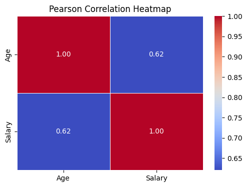
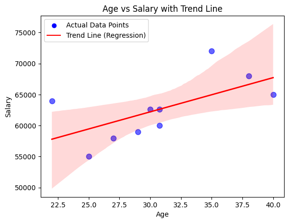
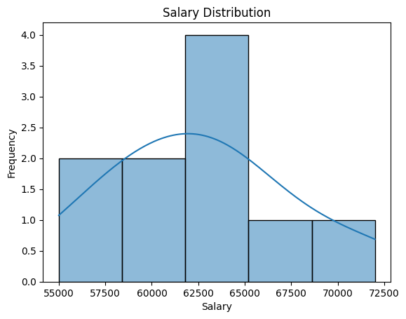
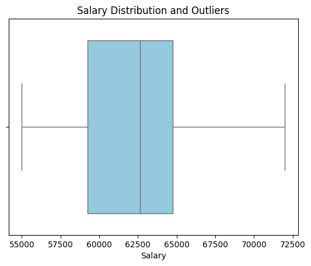

# Data Cleaning and Visualization — Activity 02

This project demonstrates a complete workflow of cleaning a messy dataset and extracting insights using statistical analysis and visualization. The focus is on handling real-world data issues and applying Pearson correlation to understand relationships between variables.

---

## Dataset Issues

The original dataset contained multiple inconsistencies:

- Missing values in Age, Salary, Name, and Country  
- Duplicate entries (e.g., repeated records for the same individual)  
- Text-based numeric values such as "thirty-eight" and "sixty five thousand"  
- Invalid and inconsistent date formats  
- Missing identifiers  

These issues made the dataset unsuitable for direct analysis.

---

## Data Cleaning Approach

The following steps were applied:

- Missing IDs and dates were handled using forward fill  
- Missing numerical values (Age, Salary) were replaced with mean values  
- Missing categorical values were filled with default or most frequent values  
- Text-based numbers were converted into numeric format  
- Dates were standardized into datetime format  
- Final dataset was converted into consistent data types for analysis  

After cleaning, the dataset became fully structured and usable.

---

## Visualization and Analysis

### Pearson Correlation Heatmap

The Pearson correlation between Age and Salary is **0.62**, indicating a moderate positive linear relationship. This suggests that salary tends to increase as age increases.

---

### Age vs Salary (Scatter Plot with Trend Line)

The scatter plot confirms the correlation result. The regression trend line shows an upward pattern, supporting the presence of a positive relationship between Age and Salary.

---

### Salary Distribution

The distribution shows that most salary values lie within the range of **60,000 to 65,000**, indicating a relatively compact dataset with limited spread.

---

### Outlier Detection

Outlier detection was performed using:

- Boxplot visualization  
- Z-score method  

No significant outliers were identified in the dataset.

---

## Key Findings

- Data cleaning was necessary due to multiple inconsistencies  
- Age and Salary show a moderate positive correlation (0.62)  
- The dataset is stable with no extreme outliers  
- Visualizations support statistical analysis results  

---

## Conclusion

This project highlights the importance of preprocessing before analysis. Even a small dataset can provide meaningful insights when properly cleaned and visualized. The use of Pearson correlation and supporting plots allows clear interpretation of relationships within the data.
